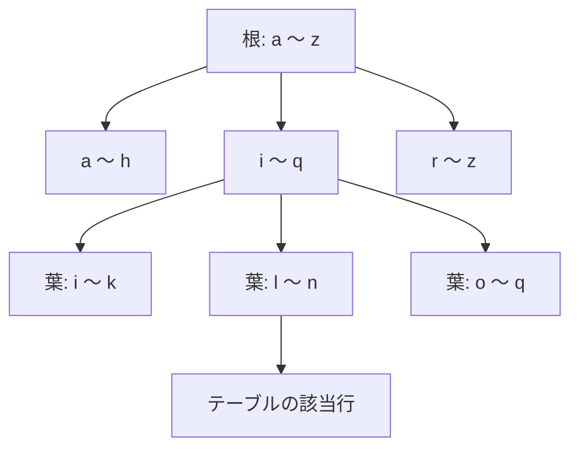

# インデックス

## インデックスとは

本の索引のようなもの。

インデックスを張った列で絞り込むとき、レコードを短時間で探せる。

インデックスを張るデメリット:

- 作成に時間がかかる
- ディスク容量を消費する
  共有バッファも消費するため、他のデータがキャッシュから追い出される
- `INSERT` / `UPDATE` / `DELETE` のたびにインデックスも更新されるため、書き込みが遅くなる
  インデックス付きの列を更新すると、HOT 更新が効かなくなり、更新コストがさらに上がる

## インデックスの仕組み

### インデックスがない場合

インデックスがないと全行を順に読む。

```sql
SELECT * FROM users WHERE email = 'user@example.com';
```

`email` にインデックスがないと、PostgreSQL はテーブルを先頭から全行読み、1行ずつ条件に合うかを確認する。
この方式を Seq Scan という。
読む量はテーブルの行数に比例するため、行数が10倍になれば、時間も10倍になる。

### インデックスがある場合

インデックスがあると木をたどって行を特定する。
デフォルトの B-tree インデックスは、列の値をソートした状態で木構造に保持し、各値に対応する行の位置を持つ。
検索では、根から葉へ数回たどるだけで、該当行の位置が分かる。
その位置を使ってテーブルから行を読む。この方式を Index Scan という。



階層の深さは、行数が100万行でも3〜4階層程度に収まる。
行数が増えても、読む量はほとんど増えない。

## インデックスの張り方

```sql
CREATE INDEX idx_users_email ON users (email);
```

- 複合インデックス `(a, b)`
- 式インデックス
- 部分インデックス
- 種類はデフォルトが B-tree。全文検索や配列・JSONB には GIN、範囲型や地理情報には GiST、巨大な時系列テーブルには BRIN を使う
- 本番で書き込みをブロックせずに作成するときは `CREATE INDEX CONCURRENTLY` を使う

## インデックスの中身を見る

TODO

## インデックスを張るとどれくらい速くなるのか

TODO

## 作成に時間がかかる

TODO

## ディスク容量を消費する

共有バッファも消費するため、他のデータがキャッシュから追い出される

## 書き込みが遅くなる

`INSERT` / `UPDATE` / `DELETE` のたびにインデックスも更新されるため、書き込みが遅くなる

インデックス付きの列を更新すると、HOT 更新が効かなくなり、更新コストがさらに上がる

## ANALYZEで計測

統計情報が古いとインデックスがあっても使われないことがあるため、`ANALYZE`で統計を更新しておく

## TODO

- <https://zenn.dev/farstep/books/learn-database-index-basics>
